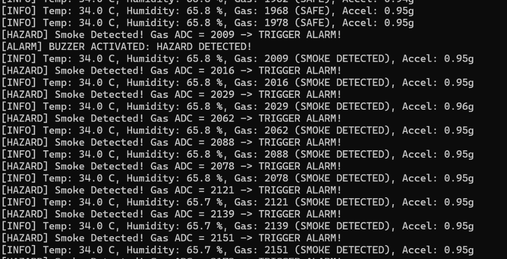
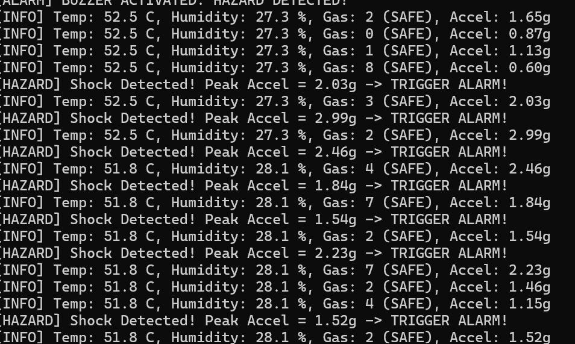
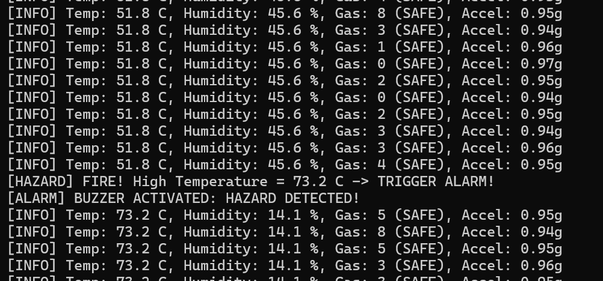
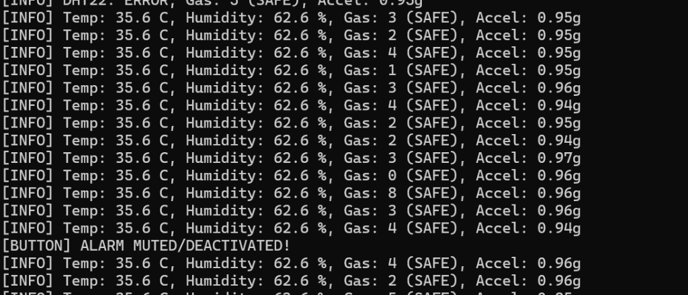

# ESP32-C3 Environmental & Hazard Monitoring System (FreeRTOS)

Midterm / Final Project: Multi-hazard environmental monitoring and alarm system based on ESP32-C3 and FreeRTOS.

## Key Features
The system is built on standard FreeRTOS task and queue management architecture:
- **Environmental Monitoring (DHT22):** Real-time monitoring of Temperature and Humidity.
- **Gas & Smoke Detection (MQ-2):** Analog readout via ADC. Triggers buzzer alarm when gas level exceeds threshold (Default: 2000). Includes fire warning when temperature > 60°C.
- **Vibration & Earthquake Detection (MPU6050):** 3-axis accelerometer via I2C interface. Immediate alarm trigger upon severe vibration (Magnitude > 1.5g).
- **Manual Control System (Push Button & Buzzer):** Push button with hardware interrupt and software debouncing (500ms hold) to manually mute or activate the alarm.

## Pinout Configuration
| Device | Device Pin | ESP32-C3 GPIO | Notes |
| :--- | :--- | :--- | :--- |
| **MQ-2 (Gas)** | `A0` (Analog) | `GPIO 0` | 5V Power supply. |
| **Push Button** | `Signal` | `GPIO 1` | Connected to GND (Internal pull-up enabled). |
| **DHT22** | `DATA` | `GPIO 2` | 10k pull-up resistor to VCC. |
| **Buzzer** | `I/O` | `GPIO 3` | Active buzzer (Active-High). |
| **MPU6050** | `SDA` | `GPIO 4` | I2C communication. |
| **MPU6050** | `SCL` | `GPIO 5` | I2C communication. |

## FreeRTOS Architecture (Tasks & Queues)
The system employs **Pre-emptive Priority-based Scheduling**, comprising 3 concurrent tasks communicating via a central message queue (`xAlarmQueue`):

| Priority | Task Name | Type | Period / Trigger | Function |
| :--- | :--- | :--- | :--- | :--- |
| **3** | `vControllerTask` | Event-driven | Message arrival on **Alarm Queue** | Actuates buzzer immediately with zero latency |
| **2** | `vButtonTask` | Event-driven | Hardware **GPIO Interrupt** | Manual alarm toggle with 500ms debounce |
| **1** | `vSensorTask` | Periodic | Periodic: **100 ms** | Samples MQ-2 & MPU6050 (100ms) and DHT22 (2000ms) |
| **0** | `Idle Task` | Background | Continuous | Resource cleanup and power saving |

## Experimental Results & Hardware Verification

The following verification results were captured directly from the serial monitor terminal:

### 1. Gas and Smoke Alarm (MQ-2 ADC > 2000)
The system detects gas concentration exceeding safety thresholds and immediately triggers the alarm:


### 2. Vibration and Shock Alarm (MPU6050 Peak Accel > 1.5g)
High vibration peak detected up to 2.99g, handled instantaneously within the 100ms cycle:


### 3. Fire Hazard Alarm (DHT22 Temperature > 60°C)
Thermal test on DHT22 sensor with temperature reaching 73.2°C, successfully triggering the fire alarm:


### 4. Manual Alarm Control (Button Interrupt)
Long pressing the push button manually deactivates/mutes the alarm:


## Build and Flash Instructions (ESP-IDF v5)
```bash
idf.py build
idf.py -p COM10 flash monitor
```
