# ESP32-C3 Environmental & Hazard Monitoring System (FreeRTOS)

Đồ án Giữa kỳ / Cuối kỳ: Hệ thống giám sát môi trường và cảnh báo nguy hiểm sử dụng ESP32-C3 và FreeRTOS.

## 🌟 Tính năng chính
Hệ thống được thiết kế chuẩn cấu trúc FreeRTOS (Task & Queue Management - theo Chương 4 & 5):
- **Giám sát Môi trường (DHT22):** Theo dõi Nhiệt độ và Độ ẩm.
- **Cảnh báo Cháy / Khí Gas (MQ2):** Đọc nồng độ Gas qua bộ chuyển đổi ADC (Analog-to-Digital). Tự động hú còi khi vượt ngưỡng an toàn (Mặc định: 2000). Tích hợp cảnh báo cháy nếu Nhiệt độ > 60°C.
- **Cảnh báo Rung chấn (MPU6050):** Theo dõi gia tốc kế qua chuẩn giao tiếp I2C. Báo động tức thời khi phát hiện rung lắc mạnh (Magnitude > 1.5g).
- **Hệ thống Cảnh báo Thủ công (Button & Buzzer):** Sử dụng Nút bấm có tích hợp chống nhiễu (Debounce 500ms) để chủ động bật/tắt còi báo động.

## 🔌 Sơ đồ đấu nối (Pinout)
| Thiết bị | Chân thiết bị | Chân ESP32-C3 | Ghi chú |
| :--- | :--- | :--- | :--- |
| **MQ2 (Gas)** | `A0` (Analog) | `GPIO 0` | Cấp nguồn 5V. |
| **Button** | `Tín hiệu` | `GPIO 1` | Đầu còn lại nối GND (Code đã bật Pull-up). |
| **DHT22** | `DATA` | `GPIO 2` | Kéo trở 10k lên VCC. |
| **Buzzer** | `I/O` | `GPIO 3` | Còi chủ động (Active-High). |
| **MPU6050** | `SDA` | `GPIO 4` | Giao tiếp I2C. |
| **MPU6050** | `SCL` | `GPIO 5` | Giao tiếp I2C. |

## 🏗 Cấu trúc FreeRTOS (Task & Queue)
Hệ thống sử dụng cơ chế **Pre-emptive Scheduling**, gồm 3 Task chạy đa nhiệm song song và giao tiếp qua 1 Queue (`xAlarmQueue`):

| Priority | Tên Task | Kiểu hoạt động (Type) | Chu kỳ / Kích hoạt | Nhiệm vụ chính |
| :--- | :--- | :--- | :--- | :--- |
| **3** | `vControllerTask` | Event-driven | Chờ tín hiệu từ **Alarm Queue** | Bật/tắt còi Buzzer ngay lập tức |
| **2** | `vButtonTask` | Event-driven | Ngắt phần cứng (**GPIO Interrupt**) | Kích hoạt báo động bằng tay (Có Debounce 500ms) |
| **1** | `vSensorTask` | Periodic | Định kỳ **100 ms** | Đọc MQ-2, MPU6050 (mỗi 100ms) & DHT22 (mỗi 2000ms) |
| **0** | `Idle Task` | Background | Liên tục (Continuous) | Dọn dẹp bộ nhớ khi CPU rảnh rỗi |

### 📊 Biểu đồ thời gian (Timing Diagram)

**1. Sơ đồ mô phỏng thực tế (Dựa trên lý thuyết Pre-emption):**
Hệ thống được thiết kế bám sát chặt chẽ theo mô hình lý thuyết Pre-emption của FreeRTOS. Dưới đây là sơ đồ diễn giải chi tiết quá trình các Task tranh giành CPU khi có sự kiện nguy hiểm và sự kiện nhấn nút xảy ra:


**2. Phiên bản Text (Mermaid) dùng để sao chép:**

```mermaid
gantt
    title Biểu đồ mô phỏng Thời gian thực thi & Pre-emption (Hệ thống Báo Cháy)
    dateFormat  X
    axisFormat %s
    
    section vCtrlTask (Pri 3)
    Nhận Queue & Bật Còi (Pre-empts Pri 1) :crit, active, ctrl1, 4, 1s
    
    section vButton (Pri 2)
    Ngắt nút bấm xảy ra (Pre-empts Pri 1)  :active, btn1, 8, 1s
    
    section vSensor (Pri 1)
    Quét cảm biến (Pre-empts Idle)         :active, sens1, 2, 1s
    Phát hiện Gas & Gửi Queue              :active, sens2, 3, 1s
    Bị cắt ngang bởi vCtrlTask             :milestone, 4, 0s
    Hoàn tất (Resumes)                     :active, sens3, 5, 1s
    Đọc Nhiệt độ (Lần thứ 20)              :active, sens4, 6, 2s
    Bị cắt ngang bởi Ngắt Button           :milestone, 8, 0s
    In Terminal (Resumes)                  :active, sens5, 9, 1s
    
    section Idle Task (Pri 0)
    Chạy nền                               :0, 2s
    Chạy nền                               :10, 2s
```



## 🚀 Kết quả Thực nghiệm & Kiểm thử Phần cứng (Hardware Verification)

Dưới đây là các kết quả đo đạc thực tế trên phần cứng, ghi nhận tại cổng Serial Terminal:

### 1. 🚨 Cảnh báo Khí Gas / Khói (MQ-2 ADC > 2000)
Hệ thống phát hiện nồng độ khói tăng vọt vượt ngưỡng an toàn ($> 2000$) và lập tức kích hoạt còi báo động:


### 2. ⚡ Cảnh báo Rung chấn / Động đất (MPU6050 Peak Accel > 1.5g)
Gia tốc rung giật mạnh đo được đạt đỉnh tới $2.99g$, hệ thống phát hiện tức thời trong chu kỳ $100\text{ ms}$:


### 3. 🔥 Cảnh báo Hỏa hoạn (DHT22 Nhiệt độ > 60°C)
Thực nghiệm gia nhiệt cảm biến DHT22, nhiệt độ nhảy vọt lên $73.2^\circ\text{C}$ kích hoạt cảnh báo cháy khẩn cấp:


### 4. 🔘 Điều khiển Tắt/Bật Còi thủ công (Button Interrupt)
Nhấn giữ nút bấm để tắt còi báo động thủ công, hệ thống chuyển sang trạng thái an toàn:


## 🛠 Hướng dẫn Build và Nạp (ESP-IDF v5)
```bash
idf.py build
idf.py -p COM10 flash monitor
```
