# Biểu đồ thời gian (Timing Diagram) - Cơ chế Pre-emption trong FreeRTOS

Dưới đây là biểu đồ mô tả quá trình các Task trong hệ thống của bạn tranh giành CPU dựa trên mức ưu tiên (Priority), hoàn toàn bám sát lý thuyết của **Chương 4: Task Management** (giống hệt cấu trúc Figure 4.18 trong sách FreeRTOS).

### 📋 Danh sách Task & Mức ưu tiên
1. **vControllerTask (Priority 4 - Cao nhất):** Chạy khi có sự kiện (Event-driven). Còi báo.
2. **vFastSensorTask (Priority 3 - Cao):** Chạy định kỳ 100ms. Rung chấn và Khói.
3. **vButtonTask (Priority 2 - Trung bình):** Chạy định kỳ 50ms. Quét nút bấm.
4. **vDhtTask (Priority 1 - Thấp):** Chạy định kỳ 2000ms. Đọc nhiệt độ/ẩm.
5. **Idle Task (Priority 0 - Rất thấp):** Chạy liên tục khi không có ai dùng CPU.

---

### 📊 Sơ đồ thực thi (Ví dụ mô phỏng 1 chu kỳ có báo động)

```mermaid
gantt
    title Biểu đồ mô phỏng Thời gian thực thi & Pre-emption (Hệ thống Báo Cháy)
    dateFormat  X
    axisFormat %s
    
    section vCtrlTask (Pri 4)
    Nhận Queue & Bật Còi (Pre-empts Pri 3) :crit, active, ctrl1, 4, 1s
    
    section vFastSens (Pri 3)
    Phát hiện Gas (Pre-empts Pri 1)  :active, fast1, 3, 1s
    Bị cắt ngang bởi vCtrlTask      :milestone, 4, 0s
    Hoàn tất (Resumes)              :active, fast2, 5, 1s
    
    section vButton (Pri 2)
    Quét Nút bấm (Pre-empts Pri 1)  :active, btn1, 8, 1s
    
    section vDhtTask (Pri 1)
    Đọc Nhiệt độ (Pre-empts Idle)    :active, dht1, 2, 1s
    Bị cắt ngang bởi vFastSensor     :milestone, 3, 0s
    Đọc tiếp (Resumes)               :active, dht2, 6, 2s
    Bị cắt ngang bởi vButton         :milestone, 8, 0s
    In ra màn hình (Resumes)         :active, dht3, 9, 1s
    
    section Idle Task (Pri 0)
    Chạy nền                         :0, 2s
    Chạy nền                         :10, 2s
```

### 📖 Giải thích chi tiết từng mốc thời gian (t1 -> t10)

Để chèn vào báo cáo, bạn có thể copy đoạn mô tả diễn biến (Scenario) chi tiết sau:

* **`t0 - t2`**: CPU đang rảnh, **Idle Task (Pri 0)** được chạy.
* **`t2`**: Tới chu kỳ 2 giây, **`vDhtTask` (Pri 1)** thức dậy. Vì Pri 1 > Pri 0, nó *pre-empts* (cắt ngang/chiếm quyền) Idle task để bắt đầu đọc nhiệt độ.
* **`t3`**: Đang đọc nhiệt độ dở dang thì tới chu kỳ 100ms của **`vFastSensorTask` (Pri 3)**. Vì Pri 3 > Pri 1, hệ điều hành FreeRTOS ngay lập tức cho `vDhtTask` tạm dừng, nhường CPU cho `vFastSensorTask` chạy.
* **`t4`**: **`vFastSensorTask`** phát hiện nồng độ Gas vượt ngưỡng 2000! Nó lập tức dùng lệnh `xQueueSend` để nhét thư cảnh báo vào Queue.
* **Ngay tại `t4`**: Ngay khi thư vào Queue, **`vControllerTask` (Pri 4)** vốn đang ngủ đông lập tức tỉnh dậy. Vì Pri 4 là mức cao nhất hệ thống, nó *pre-empts* luôn cả `vFastSensorTask` đang chạy!
* **`t4 - t5`**: **`vControllerTask`** chiếm CPU, bật điện cho còi Buzzer kêu, in dòng chữ `[ALARM]` ra màn hình. Xong việc, nó quay lại trạng thái Block chờ Queue.
* **`t5 - t6`**: CPU được trả lại cho **`vFastSensorTask`**. Nó hoàn tất chu kỳ quét và tự đưa mình vào giấc ngủ (Blocked).
* **`t6 - t8`**: CPU rớt xuống lại cho **`vDhtTask` (Pri 1)** tiếp tục việc đọc nhiệt độ.
* **`t8`**: Tới chu kỳ 50ms của **`vButtonTask` (Pri 2)**. Pri 2 lại lớn hơn Pri 1, nên `vButtonTask` thức dậy *pre-empts* `vDhtTask` để quét xem có ai bấm nút không. Không có ai bấm, nó ngủ tiếp.
* **`t9 - t10`**: **`vDhtTask`** hoàn thành việc in thông tin ra Terminal và ngủ.
* **Sau `t10`**: Tất cả các Task đều đang ngủ chờ chu kỳ tiếp theo hoặc chờ sự kiện. CPU lại được trả về cho **Idle Task**.

> **💡 Điểm ăn tiền (A+) cho báo cáo:**
> *"Hệ thống sử dụng triệt để cơ chế Pre-emptive Scheduling của FreeRTOS. Các sự kiện nguy hiểm (Khói, Cháy) được xử lý thông qua Task có độ ưu tiên cao nhất (`vControllerTask` Pri 4). Nhờ vậy, dù hệ thống đang bận đọc cảm biến DHT22 chậm chạp, nó vẫn lập tức bị ngắt ngang để bật còi báo động ngay phần ngàn giây mà không có độ trễ nào."*
