# Biểu đồ thời gian (Timing Diagram) - Cơ chế Pre-emption trong FreeRTOS

Dưới đây là biểu đồ mô tả quá trình các Task trong hệ thống của bạn tranh giành CPU dựa trên mức ưu tiên (Priority), hoàn toàn bám sát lý thuyết của **Chương 4: Task Management**.

### 📋 Danh sách Task & Mức ưu tiên
1. **vControllerTask (Priority 3 - Cao nhất):** Chạy khi có sự kiện (Event-driven). Bật/tắt còi báo.
2. **vButtonTask (Priority 2 - Trung bình):** Chạy khi có Ngắt phần cứng (GPIO Interrupt).
3. **vSensorTask (Priority 1 - Thấp):** Chạy định kỳ (Periodic 100ms). Đo Gas, Rung chấn và Nhiệt/Ẩm.
4. **Idle Task (Priority 0 - Rất thấp):** Chạy liên tục khi không có ai dùng CPU.

---

### 📊 Sơ đồ thực thi (Ví dụ mô phỏng 1 chu kỳ có báo động)

```mermaid
gantt
    title Biểu đồ mô phỏng Thời gian thực thi & Pre-emption (Hệ thống Báo Cháy)
    dateFormat  X
    axisFormat %s
    
    section vCtrlTask (Pri 3)
    Nhận Queue & Bật Còi (Pre-empts Pri 1) :crit, active, ctrl1, 4, 1s
    
    section vButton (Pri 2)
    Ngắt nút bấm xảy ra (Pre-empts Pri 1)  :active, btn1, 8, 1s
    
    section vSensor (Pri 1)
    Quét cảm biến (Pre-empts Idle)         :active, sens1, 2, 1s
    Phát hiện Gas & Gửi Queue              :active, sens2, 3, 1s
    Bị cắt ngang bởi vCtrlTask             :milestone, 4, 0s
    Hoàn tất (Resumes)                     :active, sens3, 5, 1s
    Đọc Nhiệt độ (Lần thứ 20)              :active, sens4, 6, 2s
    Bị cắt ngang bởi Ngắt Button           :milestone, 8, 0s
    In Terminal (Resumes)                  :active, sens5, 9, 1s
    
    section Idle Task (Pri 0)
    Chạy nền                               :0, 2s
    Chạy nền                               :10, 2s
```

### 📖 Giải thích chi tiết từng mốc thời gian (t1 -> t10)

Để chèn vào báo cáo, bạn có thể copy đoạn mô tả diễn biến (Scenario) chi tiết sau:

* **`t0 - t2`**: CPU đang rảnh, **Idle Task (Pri 0)** được chạy.
* **`t2`**: Tới chu kỳ 100ms, **`vSensorTask` (Pri 1)** thức dậy. Vì Pri 1 > Pri 0, nó *pre-empts* (chiếm quyền) Idle task để đọc Khói và Rung chấn.
* **`t3`**: **`vSensorTask`** phát hiện nồng độ Gas vượt ngưỡng 2000! Nó lập tức dùng lệnh `xQueueSend` để nhét thư cảnh báo vào Queue.
* **Ngay tại `t4`**: Ngay khi thư vào Queue, **`vControllerTask` (Pri 3)** vốn đang ngủ đông lập tức tỉnh dậy. Vì Pri 3 là mức cao nhất hệ thống, nó *pre-empts* luôn cả `vSensorTask` đang chạy!
* **`t4 - t5`**: **`vControllerTask`** chiếm CPU, bật điện cho còi Buzzer kêu, in dòng chữ `[ALARM]` ra màn hình. Xong việc, nó quay lại trạng thái Block.
* **`t5 - t6`**: CPU được trả lại cho **`vSensorTask`**. Nó hoàn tất chu kỳ quét.
* **`t6 - t8`**: Luồng **`vSensorTask`** (ở chu kỳ thứ 20) bắt đầu gọi hàm đọc DHT22 (việc này tốn thời gian).
* **`t8`**: Bất thình lình người dùng nhấn nút! Phần cứng sinh ra một Ngắt (GPIO Interrupt) đánh thức **`vButtonTask` (Pri 2)**. Vì Pri 2 > Pri 1, `vButtonTask` cắt ngang `vSensorTask` để xử lý ngắt, chống rung và gửi lệnh Queue.
* **`t9 - t10`**: Nút bấm xử lý xong, **`vSensorTask`** được trả lại CPU để in thông số DHT22 ra Terminal.
* **Sau `t10`**: Tất cả các Task đều đang ngủ chờ chu kỳ tiếp theo hoặc chờ sự kiện. CPU lại được trả về cho **Idle Task**.

> **💡 Điểm ăn tiền (A+) cho báo cáo:**
> *"Hệ thống sử dụng triệt để cơ chế Pre-emptive Scheduling của FreeRTOS. Các sự kiện nguy hiểm (Khói, Cháy) được xử lý thông qua Task có độ ưu tiên cao nhất (`vControllerTask` Pri 4). Nhờ vậy, dù hệ thống đang bận đọc cảm biến DHT22 chậm chạp, nó vẫn lập tức bị ngắt ngang để bật còi báo động ngay phần ngàn giây mà không có độ trễ nào."*
